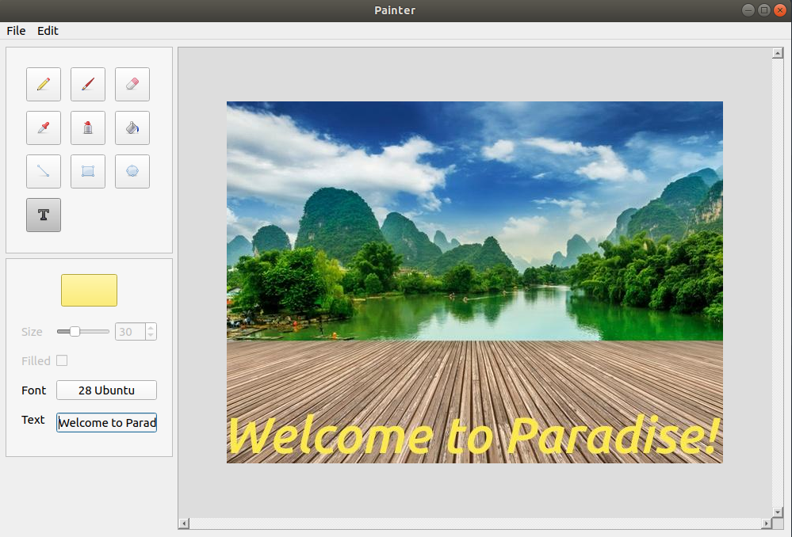
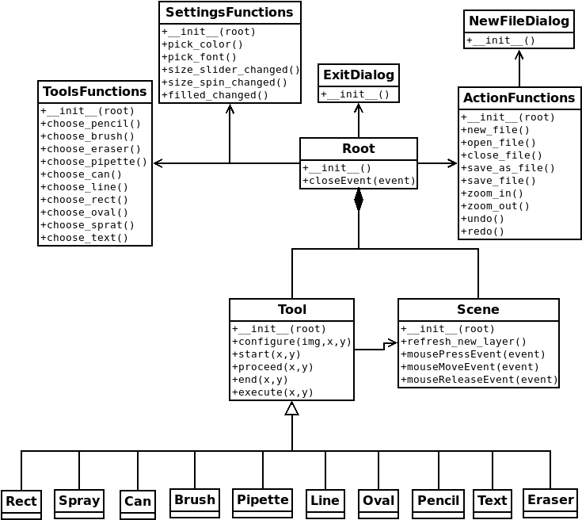

#Painter

This is my version of painting app.

PIL and PyQt library are used in the project, so you have to download them. 
Here are some instructions.

Windows:

	- install python (https://www.python.org/downloads/release/python-373/)
	- run installers/windows.bat to install libraries
	- run run.bat to run the app

Linux:

	- run installers/linux.sh to install python and libraries
	- run run.sh to run the app

Mac:

	- run installers/mac.sh to install python and libraries
	- run run.sh to run the app

Screenshot:

 

Class diagram:

 
